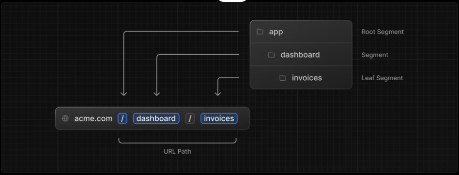
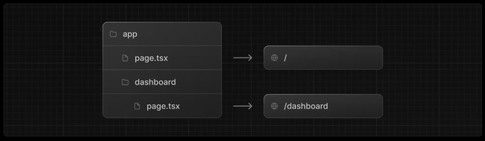

# 1. Getting Started

- https://nextjs.org/learn/dashboard-app/getting-started

```bash
npm install -g pnpm
```

```bash
# create-next-app@latest next.jsのプロジェクト作成用CLI
# nextjs-dashboard プロジェクトのディレクトリ名
# --example サンプルプロジェクトをテンプレートにする指定
# --use-pnpm パッケージマネージャーとしてpnpmを使う指定
npx create-next-app@latest nextjs-dashboard \
  --example "https://github.com/vercel/next-learn/tree/main/dashboard/starter-example" \
  --use-pnpm

cd nextjs-dashboard
```

ディレクトリ構成

- `app/`  
アプリケーションのすべてのルート、コンポーネント、ロジックが含まれており、殆どの作業はここで行う
    - `lib/`  
    再利用可能なユーティリティ関数やデータ取得関数など。
    - `ui/`  
    カード、テーブル、フォームなど、アプリケーションのUIコンポーネント。
- `/public`  
  画像など、静的アセット
- `next.confit.tf`  
  設定ファイル


```
├── app
│   ├── layout.tsx
│   ├── lib
│   │   ├── data.ts
│   │   ├── definitions.ts  // データベースから返される型の定義
│   │   ├── placeholder-data.ts  // プレースホルダデータ
│   │   └── utils.ts
│   ├── page.tsx
│   ├── query
│   │   └── route.ts
│   ├── seed
│   │   └── route.ts
│   └── ui
│       ├── acme-logo.tsx
│       ├── button.tsx
│       ├── customers
│       │   └── table.tsx
│       ├── dashboard
│       │   ├── cards.tsx
│       │   ├── latest-invoices.tsx
│       │   ├── nav-links.tsx
│       │   ├── revenue-chart.tsx
│       │   └── sidenav.tsx
│       ├── global.css
│       ├── invoices
│       │   ├── breadcrumbs.tsx
│       │   ├── buttons.tsx
│       │   ├── create-form.tsx
│       │   ├── edit-form.tsx
│       │   ├── pagination.tsx
│       │   ├── status.tsx
│       │   └── table.tsx
│       ├── login-form.tsx
│       ├── search.tsx
│       └── skeletons.tsx
├── next.config.ts
├── next-env.d.ts
├── node_modules
├── package.json
├── pnpm-lock.yaml
├── postcss.config.js
├── public
│   ├── customers
│   │   ├── amy-burns.png
│   │   ├── balazs-orban.png
│   │   ├── delba-de-oliveira.png
│   │   ├── evil-rabbit.png
│   │   ├── lee-robinson.png
│   │   └── michael-novotny.png
│   ├── favicon.ico
│   ├── hero-desktop.png
│   ├── hero-mobile.png
│   └── opengraph-image.png
├── README.md
├── tailwind.config.ts
└── tsconfig.json
```

サーバーの起動

```bash
pnpm i
pnpm dev
```

# 2. CSSスタイル

- https://nextjs.org/learn/dashboard-app/css-styling


`/app/ui/global.css` でアプリケーション内のすべてのルートにCSSルールを適用します。

`/app/layout.tsx` ファイルで `/app/ui/global.css` をインポートすることでアプリケーションにグローバルスタイルを追加できます。


`/app/layout.tsx`

```tsx
import '@/app/ui/global.css'; // 追加
 
export default function RootLayout({
  children,
}: {
  children: React.ReactNode;
}) {
  return (
    <html lang="en">
      <body>{children}</body>
    </html>
  );
}
```

> NOTE: import の `@` はプロジェクトのルートを指します。  
> この設定は `tsconfig.json` に記述されています。
>
> ```js
> {
>   "compilerOptions": {
>     "baseUrl": ".",  // モジュール解決の基準ディレクトリを指定
>     "paths": {
>       // keyがインポート側の書き方、valueが実際のファイルパス
>       "@/*": ["./*"]  // @/xxx と書いたら ./xxx を見に行け
>     }
>   }
> }
> ```


`/app/ui/global.css` にはほとんど記述がないにも関わらず、結構リッチなスタイルがつくのは、以下の定義のおかげです。


`/app/ui/global.css` 
```css
@tailwind base;
@tailwind components;
@tailwind utilities;
```

## Tailwindcss

[Tailwindユーティリティクラス](https://tailwindcss.com/docs/styling-with-utility-classes)

Tailwindcssを使うと、以下のようにクラス名ベースでスタイルをつけられます。

```tsx
<h1 className="text-blue-500">I'm blue!</h1>
```

`/app/page.tsx` を確認すると要素の `className` にtailwindのクラスが使用されていることがわかります。


## CSSモジュール

- [CSS Modules | NEXT.js](https://nextjs.org/docs/13/app/building-your-application/styling/css-modules)


CSSモジュールを使用すると一意のクラス名を自動生成してCSSをコンポーネントにスコープできるため、衝突の心配がありません。

`/app/ui/home.module.css`

```css
.shape {
  height: 0;
  width: 0;
  border-bottom: 30px solid black;
  border-left: 20px solid transparent;
  border-right: 20px solid transparent;
}
```


`/app/page.tsx`

```tsx
import AcmeLogo from '@/app/ui/acme-logo';
import { ArrowRightIcon } from '@heroicons/react/24/outline';
import Link from 'next/link';
import styles from '@/app/ui/home.module.css';  // CSSモジュールのインポート
 
export default function Page() {
  return (
    <main className="flex min-h-screen flex-col p-6">
      <div className={styles.shape} />  {/* CSSモジュールで定義したshapeクラスを使用 */}
    // ...
  )
}
```

## `clsx` ライブラリでクラス名を切り替える

- [clsx | GitHub](https://github.com/lukeed/clsx)


要素の状態やその他の条件に基づいて、スタイルを適用したり除外したりする場合に利用します。


`clsx` はクラス名を簡単に切り替えられるライブラリです。

```tsx
function sample({ status }: {status: boolean}) {
  return (
    <div className={clsx(
      'px-2 py-1',  // 共通クラス

      { // 条件付きクラス「クラス名:条件」の形式になっており、条件がtrueのクラスが適用される
        'block': status === true,
        'hidden': status === false,
      }
      )} />
  )

}
```


# 3. フォントと画像の最適化

- https://nextjs.org/learn/dashboard-app/optimizing-fonts-images


## フォントの最適化

ブラウザが最初にシステムフォントでテキストレンダリングし、その後カスタムフォントに置き換えることでレイアウトシフトが発生しますが、 Next.jsではビルド時にフォントファイルをダウンロードし静的アセットとともにホストすることでパフォーマンスに影響を与えるようなフォントの追加ネットワークリクエストは発生しません。


### プライマリフォントの追加

カスタムGoogleフォントをアプリケーションに追加してみます。

アプリケーション全体で使用するフォントを定義する `/app/ui/fonts.ts` を作成します。


`next/font/google` モジュールから `Inter` フォントをインポートします。
サブセット には 'latin' を指定します。

`/app/ui/fonts.ts`
```ts
// next/font/google は Google Fonts を直接使うための Next.js 組み込みモジュール。
// Inter は Google Fonts に登録されている、UI 向けに設計されたモダンなサンセリフ体（ゴシック体）フォント
import { Inter } from 'next/font/google';
// どの文字セット(subsets)を使うかを指定
// latin（英語・西欧言語）
// latin-ext（中央ヨーロッパ言語）
// japanese（Noto Sans JP など）
export const inter = Inter({ subsets: ['latin'] });
```

`/app/layout.tsx`
```tsx
import '@/app/ui/global.css';
import { inter } from '@/app/ui/fonts'; // 追加

export default function RootLayout({
  children,
}: {
  children: React.ReactNode;
}) {
  return (
    <html lang="en">
      {/* antialiased Tailwindのフォントを滑らかにするクラス */}
      <body className={`${inter.className} antialiased`}>{children}</body>
    </html>
  );
}
```

### セカンダリフォントの追加


`/app/ui/fonts.ts`
```ts
// ... 略 ...
export const lusitana = Lusitana({ subsets: ['latin'], weight: ['400', '700'] });
```


`/app/page.tsx`
```tsx
// ... 略 ...
import { lusitana } from '@/app/ui/fonts';

export default function Page() {
  return (
    <main className="flex min-h-screen flex-col p-6">
      <div className="flex h-20 shrink-0 items-end rounded-lg bg-blue-500 p-4 md:h-52">
        <AcmeLogo />  {/* コメントイン */}
      </div>
      {/* ... 略 ... */}
          {/* lusitanaフォントのクラス名を追加 */}
          <p className={`${lusitana.className} text-xl text-gray-800 md:text-3xl md:leading-normal`}>
      {/* ... 略 ... */}
          </p>
      {/* ... 略 ... */}
    </main>
  );
}
```

# 画像の最適化

Next.jsは、画像などの静的アセットを `/public` から提供します。`/public` 内のファイルはアプリケーション内で参照可能です。


## `<Image>` コンポーネント

[Image Component | NEXT.js](https://nextjs.org/docs/app/api-reference/components/image)

`<Image>` コンポーネントはHTMLの `` の拡張であり次のような最適化機能が備わっています。

- 画像読み込み時にレイアウトシフトが発生しないようにする
- viewportの小さいデバイスに大きな画像が送信されないように、画像サイズを変更する
- デフォルトで画像を遅延読込する (viewportに入ると読み込まれます)
- ブラウザが対応している場合、WebPやAVIFなどの最新形式で画像を提供する


`/app/page.tsx`
```tsx
// ...
import Image from 'next/image';  // 追加


export default function Page() {
  return (
    <main className="flex min-h-screen flex-col p-6">
      <div>
        {/* ... */}
        <div className="flex items-center justify-center p-6 md:w-3/5 md:px-28 md:py-12">
          {/* デスクトップ用 */}
          <Image
            src="/hero-desktop.png"
            width={1000}
            height={760}
            className="hidden md:block"
            alt="Screenshots of the dashboard project showing desktop version"
          />
          {/* モバイル用 */}
          <Image
            src="/hero-mobile.png"
            width={560}
            height={620}
            className="block md:hidden"
            alt="Screenshots of the dashboard project showing mobile version"
          />
        </div>
      </div>
    </main>
  );
}
```
`width` `height` を設定しておくことで、レイアウト連れを防ぐことができます。これらの指定はソース画像と同じアスペクト比に合わせます。

モバイル画面では画像がDOMから削除されるように `hidden` クラスが、デスクトップ画面では画像が表示されるように `md:block` クラスが設定されています。

# 4. レイアウトとページの作成

- https://nextjs.org/learn/dashboard-app/creating-layouts-and-pages

**レイアウト** と **ページ** を使ってより多くのルートを作成する方法を学びましょう

Next.jsはファイルシステムルーティングを採用しており、フォルダを用いてネストされたルートを作成します。




各ルートごとに、`layout.tsx` と `page.tsx` ファイルを使用して個別の UI を作成できます。  
`page.tsx` は React コンポーネントをエクスポートする特別な Next.js ファイルであり、ルートにアクセス可能にするために必須です。

※ つまり `page.txt` が配置してあるディレクトリが公開可能なルートとなります





## ダッシュボードページの作成

`/app/dashboard/page.tsx`
```tsx
export default function Page() {
  return <p>Dashboard Page</p>;
}
```

`/app/dashboard/customers/page.tsx`
```tsx
export default function Page() {
  return <p>Customers Page</p>;
}
```

`/app/dashboard/invoices/page.tsx`
```tsx
export default function Page() {
  return <p>Invoices Page</p>;
}
```

- http://localhost:3000/dashboard
    - http://localhost:3000/dashboard/customers
    - http://localhost:3000/dashboard/invoices

## ダッシュボードレイアウトの作成

ダッシュボードには、複数のページで共有されるナビゲーション機能があります。Next.jsでは、特別なlayout.tsxファイルを使って複数のページで共有されるUIを作成できます。

`/app/dashboard/layout.tsx`
```tsx
import SideNav from '@/app/ui/dashboard/sidenav'

export default function Layout({ children }: { children: React.ReactNode }) {
  return (
    <div className="flex h-screen flex-col md:flex-row md:overflow-hidden">
      <div className="w-full flex-none md:w-64">
        <SideNav />
      </div>
      <div className="flex-grow p-6 md:overflow-y-auto md:p-12">{children}</div>
    </div>
  );
}
```

このレイアウトはそれ以下のページ(`dashboard/customers/page.tsx` `dashboard/invoices/page.tsx`)に自動的に適用されます。

Next.jsでレイアウトを使用する利点の一つは、ナビゲーション時にページコンポーネントのみが更新され、レイアウトは再レンダリングされないことです。(部分レンダリング)

## ルートレイアウト

`/app/layout.tsx` は[ルートレイアウト](https://nextjs.org/docs/app/api-reference/file-conventions/layout#root-layout)と呼ばれ、すべてのNext.jsアプリケーションに必須です。ルートレイアウトに追加したUIは、すべてのページで共有されます。

`/app/layout.tsx`
```tsx
import '@/app/ui/global.css';
import { inter } from '@/app/ui/fonts';

export default function RootLayout({
  children,
}: {
  children: React.ReactNode;
}) {
  return (
    <html lang="en">
      {/* antialiased Tailwindのフォントを滑らかにするクラス */}
      <body className={`${inter.className} antialiased`}>{children}</body>
    </html>
  );
}
```