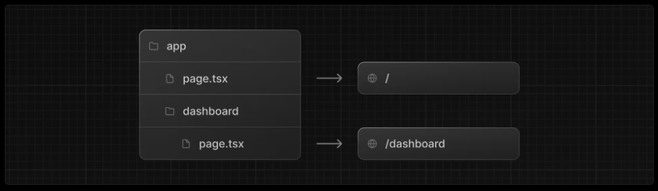

# 4. レイアウトとページの作成

- https://nextjs.org/learn/dashboard-app/creating-layouts-and-pages

**レイアウト** と **ページ** を使ってより多くのルートを作成する方法を学びましょう

Next.jsはファイルシステムルーティングを採用しており、フォルダを用いてネストされたルートを作成します。


各ルートごとに、`layout.tsx` と `page.tsx` ファイルを使用して個別の UI を作成できます。  
`page.tsx` は React コンポーネントをエクスポートする特別な Next.js ファイルであり、ルートにアクセス可能にするために必須です。

※ つまり `page.txt` が配置してあるディレクトリが公開可能なルートとなります





## ダッシュボードページの作成

`/app/dashboard/page.tsx`
```tsx
export default function Page() {
  return <p>Dashboard Page</p>;
}
```

`/app/dashboard/customers/page.tsx`
```tsx
export default function Page() {
  return <p>Customers Page</p>;
}
```

`/app/dashboard/invoices/page.tsx`
```tsx
export default function Page() {
  return <p>Invoices Page</p>;
}
```

- http://localhost:3000/dashboard
    - http://localhost:3000/dashboard/customers
    - http://localhost:3000/dashboard/invoices

## ダッシュボードレイアウトの作成

ダッシュボードには、複数のページで共有されるナビゲーション機能があります。Next.jsでは、特別なlayout.tsxファイルを使って複数のページで共有されるUIを作成できます。

`/app/dashboard/layout.tsx`
```tsx
import SideNav from '@/app/ui/dashboard/sidenav'

export default function Layout({ children }: { children: React.ReactNode }) {
  return (
    <div className="flex h-screen flex-col md:flex-row md:overflow-hidden">
      <div className="w-full flex-none md:w-64">
        <SideNav />
      </div>
      <div className="flex-grow p-6 md:overflow-y-auto md:p-12">{children}</div>
    </div>
  );
}
```

このレイアウトはそれ以下のページ(`dashboard/customers/page.tsx` `dashboard/invoices/page.tsx`)に自動的に適用されます。

Next.jsでレイアウトを使用する利点の一つは、ナビゲーション時にページコンポーネントのみが更新され、レイアウトは再レンダリングされないことです。(部分レンダリング)

## ルートレイアウト

`/app/layout.tsx` は[ルートレイアウト](https://nextjs.org/docs/app/api-reference/file-conventions/layout#root-layout)と呼ばれ、すべてのNext.jsアプリケーションに必須です。ルートレイアウトに追加したUIは、すべてのページで共有されます。

`/app/layout.tsx`
```tsx
import '@/app/ui/global.css';
import { inter } from '@/app/ui/fonts';

export default function RootLayout({
  children,
}: {
  children: React.ReactNode;
}) {
  return (
    <html lang="en">
      {/* antialiased Tailwindのフォントを滑らかにするクラス */}
      <body className={`${inter.className} antialiased`}>{children}</body>
    </html>
  );
}
```
