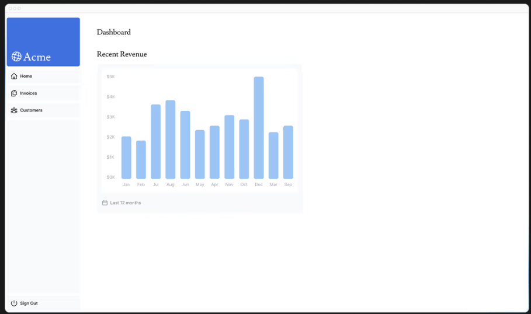

# 7. データの取得

- https://nextjs.org/learn/dashboard-app/fetching-data

React サーバー コンポーネントを使用している場合は、API レイヤーをスキップして、データベース認証情報をクライアントに公開するリスクなしに、データベースを直接クエリできます。

## サーバーコンポーネントを使用してデータを取得する

Next.jsアプリケーションはデフォルトでReact Server Componentsを使用します。Server Componentsを使ったデータ取得は比較的新しいアプローチであり、いくつかの利点があります。

- サーバーコンポーネントはJavaScriptのPromiseをサポートしており、データ取得を非同期で実行できます。`useEffect` や `useState` といったデータ取得ライブラリなしに、async/await構文を使用できます。
- サーバーコンポーネントはサーバー上で実行されるため、負荷の高いデータ取得やロジックをサーバー側に保持し、結果のみをクライアントに送信できます。
- サーバーコンポーネントはサーバー上で実行されるため、追加のAPIレイヤーを介さずにデータベースを直接クエリできます。

## SQLの使用

SQLは以下に用意してあります。

- `/app/lib/data.ts` SQLを実行する関数群が定義されています
- `/app/lib/definitions.ts` SQLの実行結果のデータ型が定義されています

postgresはローカルに構築してあるので `ssl: false` に設定します。


`/app/lib/data.ts`
```ts
import postgres from 'postgres';
import { Revenue } from './definitions';

const sql = postgres(process.env.POSTGRES_URL!, { ssl: false });

export async function fetchRevenue(): Promise<postgres.RowList<Revenue[]>> {
  try {
    const data = await sql<Revenue[]>`SELECT * FROM revenue`;
    return data;
  } catch (error) {
    console.error('Database Error:', error);
    throw new Error('Failed to fetch revenue data.');
  }
}

// ...
```


`/app/lib/definitions.ts`
```ts
export type Revenue = {
  month: string;
  revenue: number;
};
```

## ダッシュボードのデータ取得準備

データ取得用のページを作成します。

`/app/dashboard/page.tsx`
```tsx
import { Card } from '@/app/ui/dashboard/cards';
import RevenueChart from '@/app/ui/dashboard/revenue-chart';
import LatestInvoices from '@/app/ui/dashboard/latest-invoices';
import { lusitana } from '@/app/ui/fonts';
 
export default async function Page() {
  return (
    <main>
      <h1 className={`${lusitana.className} mb-4 text-xl md:text-2xl`}>
        Dashboard
      </h1>
      <div className="grid gap-6 sm:grid-cols-2 lg:grid-cols-4">
        {/* <Card title="Collected" value={totalPaidInvoices} type="collected" /> */}
        {/* <Card title="Pending" value={totalPendingInvoices} type="pending" /> */}
        {/* <Card title="Total Invoices" value={numberOfInvoices} type="invoices" /> */}
        {/* <Card title="Total Customers" value={numberOfCustomers} type="customers" /> */}
      </div>
      <div className="mt-6 grid grid-cols-1 gap-6 md:grid-cols-4 lg:grid-cols-8">
        {/* <RevenueChart revenue={revenue}  /> */}
        {/* <LatestInvoices latestInvoices={latestInvoices} /> */}
      </div>
    </main>
  );
}
```

データを受信するコンポーネントが3つあります(`<Card>` `<RevenueChart>` `<LatestInvoices>` )。これらは現在コメントアウトされており、まだ実装されていません。

## `<RevenueChart>` のデータを取得

`<RevenueChart/>` コンポーネントのデータを取得するには、 `/app/lib/data.ts` の `fetchRevenue` 関数をインポートしてコンポーネント内で呼び出します。

`/app/dashboard/page.tsx`
```tsx
// ...
import { fetchRevenue } from '@/app/lib/data'; // fetchRevenueのインポート
 
export default async function Page() {  // fetchRevenueは非同期関数なので、呼び出し側のPageも非同期関数にする
  const revenue = await fetchRevenue();  // fetchRevenueの呼び出し
  return (
    <main>
      {/* ... */}
      <div className="mt-6 grid grid-cols-1 gap-6 md:grid-cols-4 lg:grid-cols-8">
        <RevenueChart revenue={revenue} /> {/* RevenueChartをコメントイン */}
      </div>
    </main>
  );
}
```

次に `RevenueChart` コンポーネントのコメントアウトされている部分をコメントインします。

`/app/ui/dashboard/revenue-chart.tsx`



## `<LatestInvoices />` のデータを取得

`<LatestInvoices />` は最新の請求書を5軒取得して表示するコンポーネントです。

SQLのクエリは次のようになっています。
`/app/lib/data.ts`
```ts
// Fetch the last 5 invoices, sorted by date
const data = await sql<LatestInvoiceRaw[]>`
  SELECT invoices.amount, customers.name, customers.image_url, customers.email
  FROM invoices
  JOIN customers ON invoices.customer_id = customers.id
  ORDER BY invoices.date DESC
  LIMIT 5`;
```

`<LatestInvoices/>` コンポーネントのデータを取得するには、 `/app/lib/data.ts` の `fetchLatestInvoices` 関数をインポートしてコンポーネント内で呼び出します。

`/app/dashboard/page.tsx`
```tsx
// ...
import { fetchRevenue, fetchLatestInvoices } from '@/app/lib/data'; // fetchLatestInvoicesのインポート
 
export default async function Page() {
  const revenue = await fetchRevenue();
  const latestInvoices = await fetchLatestInvoices();  // fetchLatestInvoicesの呼び出し
  return (
    <main>
      {/* ... */}
      <div className="mt-6 grid grid-cols-1 gap-6 md:grid-cols-4 lg:grid-cols-8">
        <RevenueChart revenue={revenue} />
        <LatestInvoices latestInvoices={latestInvoices} />  {/* LatestInvoicesをコメントイン */}
      </div>
    </main>
  );
}
```

次に `LatestInvoices` コンポーネントのコメントアウトされている部分をコメントインします。


## `<Card>` コンポーネントのデータを取得する

カードコンポーネントには以下のデータが表示されます。

- 回収した請求書の合計金額。
- 保留中の請求書の合計金額。
- 請求書の合計数。
- 顧客総数。

`<Card/>` コンポーネントのデータを取得するには、 `/app/lib/data.ts` の `fetchCardData` 関数をインポートしてコンポーネント内で呼び出します。
`fetchCardData` は4つの結果を返却します。


`/app/dashboard/page.tsx`
```tsx
// ...
import { fetchRevenue, fetchLatestInvoices, fetchCardData } from '@/app/lib/data'; // fetchCardData のインポート
 
export default async function Page() {
  const revenue = await fetchRevenue();
  const latestInvoices = await fetchLatestInvoices();
  const {
    totalPaidInvoices,
    totalPendingInvoices,
    numberOfInvoices,
    numberOfCustomers
  } = await fetchCardData();  // fetchCardData の呼び出し
  return (
    <main>
      {/* ... */}
      <div className="grid gap-6 sm:grid-cols-2 lg:grid-cols-4">
        <Card title="Collected" value={totalPaidInvoices} type="collected" />
        <Card title="Pending" value={totalPendingInvoices} type="pending" />
        <Card title="Total Invoices" value={numberOfInvoices} type="invoices" />
        <Card title="Total Customers" value={numberOfCustomers} type="customers" />
      </div>
      <div className="mt-6 grid grid-cols-1 gap-6 md:grid-cols-4 lg:grid-cols-8">
        {/* ... */}
      </div>
    </main>
  );
}
```


## 注意すべき点

この構成はパフォーマンス上の2つの問題があります。

- データ要求が意図せず相互にブロックされ、要求ウォーターフォールが発生します。
- デフォルトでは、Next.jsはパフォーマンス向上のためにルートを事前レンダリングします。これは静的レンダリングと呼ばれます。そのため、データが変更されてもダッシュボードには反映されません。

## リクエストフォーターフォール

「ウォーターフォール」とは、前のリクエストの完了に依存する一連のネットワークリクエストを指します。データ取得の場合、各リクエストは前のリクエストがデータを返した後にのみ開始されます。


例えば、以下のコードだと、 `fetchLatestInvoices()` を実行するには `fetchRevenue()` の完了を待たなければなりません。

`/app/dashboard/page.tsx`
```tsx
const revenue = await fetchRevenue();
const latestInvoices = await fetchLatestInvoices(); // wait for fetchRevenue() to finish
const {
  numberOfInvoices,
  numberOfCustomers,
  totalPaidInvoices,
  totalPendingInvoices,
} = await fetchCardData(); // wait for fetchLatestInvoices() to finish
```

このパターンは必ずしも悪いわけではありません。次のリクエストを行う前に条件を満たしたい場合、ウォーターフォールが必要となる場合があります。例えば、まずユーザーのIDとプロフィール情報を取得したい場合です。IDを取得したら、次に友達リストの取得に進むことができます。この場合、各リクエストは前のリクエストで返されたデータに依存します。

ただし、この動作は意図しないものであり、パフォーマンスに影響を与える可能性もあります。


## 並列データ取得

ウォーターフォールを回避する一般的な方法は、すべてのデータ要求を同時に、つまり並行して開始することです。


JavaScriptでは、Promise.all()またはPromise.allSettled()関数を使って、すべてのPromiseを同時に開始します。  
例えば、 `/app/lib/data.ts` の `fetchCardData()` では関数内で `Promise.all()` を使用しています。

`/app/lib/data.ts` 
```ts
export async function fetchCardData() {
  try {
    const invoiceCountPromise = sql`SELECT COUNT(*) FROM invoices`;
    const customerCountPromise = sql`SELECT COUNT(*) FROM customers`;
    const invoiceStatusPromise = sql`SELECT
         SUM(CASE WHEN status = 'paid' THEN amount ELSE 0 END) AS "paid",
         SUM(CASE WHEN status = 'pending' THEN amount ELSE 0 END) AS "pending"
         FROM invoices`;
 
    const data = await Promise.all([
      invoiceCountPromise,
      customerCountPromise,
      invoiceStatusPromise,
    ]);
    // ...
  }
}
```


このパターンを使用すると、次のことが可能になります。

- すべてのデータ取得を同時に実行し始めます。
- あらゆるライブラリやフレームワークに適用できるネイティブ JavaScript パターンを使用します。

しかし、このパターンには欠点が1つあります。時間のかかるデータ取得があると、すべてのデータ取得が遅くなってしまうということです。次の章で詳しく見ていきましょう。
