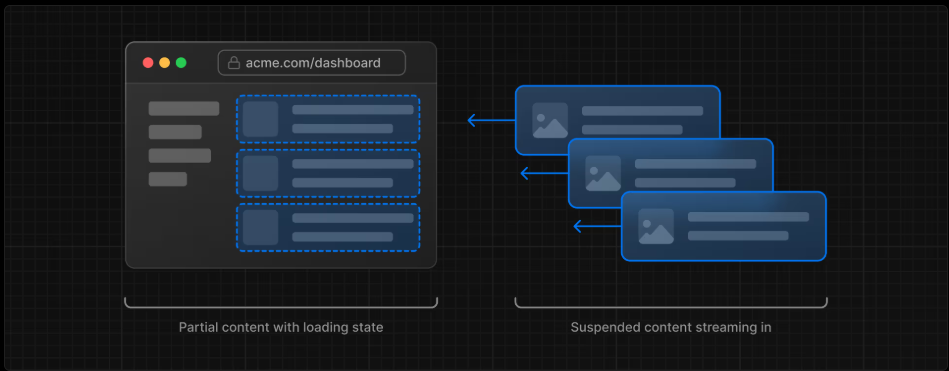

# 9. ストリーミング

前章で問題となったデータリクエストの遅延が発生した場合に、ユーザーエクスペリエンスを向上させる方法を見ていきましょう。

## ストリーミング

ストリーミングとは、ルートを小さな「チャンク」に分割し、準備が整い次第、サーバーからクライアントへ順次転送することができるデータを転送する技術です。



レスポンスの遅いリクエストを別のチャンクにすることで、遅いデータリクエストがページ全体をブロックするのを防げます。


ストリーミングはReactのコンポーネントモデルと相性が良く、各コンポーネントをチャンクと見なすことができます。

Next.jsでストリーミングを実装する方法は2つあります：

- **ページレベル** : loading.tsxファイルを使用（`<Suspense>` を自動生成）
- **コンポーネントレベル** : より細かい制御のための `<Suspense>` を使用


## ページレベルのストリーミング ( `loading.tsx` )

`loading.tsx` は React Suspense を基盤とした Next.js の特殊なファイルです。ページコンテンツの読み込み中に表示する代替用フォールバック UI を作成できます。

`/app/dashboard/loading.tsx`
```tsx
export default function Loading() {
  return <div>Loading...</div>;
}
```


1. `<SideNav>` は静的要素のため即時表示されます。動的コンテンツの読み込み中もユーザーは `<SideNav>` とインタラクション可能です。
2. ユーザーはページ読み込み完了を待たずに移動できます（interruptable navigation)

### ローディングスケルトン

UXをさらに向上させるために、テキストではなくローディングスケルトンを表示してみましょう。

`loading.tsx` ファイルで `<DashboardSkeleton>` をインポートします。


`/app/dashboard/loading.tsx`
```tsx
import DashboardSkeleton from "@/app/ui/skeletons";

export default function Loading() {
  return <DashboardSkeleton />;
}
```


### Route Groupでスケルトンの読み込みバグを修正

- [Route Group | NEXT.js](https://nextjs.org/docs/app/api-reference/file-conventions/route-groups)

現在、ローディング用スケルトンは `/app/dashboard/page.tsx` に適用されますが、 `/app/dashboard/loading.tsx` は下位の `/invoices/page.tsx` および `/customers/page.tsx` にも適用されてしまいます。

`/app/dashboard/page.tsx` のみのローディング画面としたい場合は [Route Group](https://nextjs.org/docs/app/api-reference/file-conventions/route-groups) を利用することでこれを解決できます。  
Route Group  `/app/dashboard/(hogehoge)/page.tsx` のようにフォルダ名を括弧でくくることで作成でき、**`()` で囲まれた名前はURLパスに含まれない**ので、URLパスに影響を与えずにファイルを論理的なグループに整理できます。  
※ 例 `(marketing)` `(shop)` など

ここでは、ルートグループを使用して `loading.tsx` がダッシュボードページにのみ適用されるようにします。

```bash
mkdir -p "app/dashboard/(overview)"

mv "app/dashboard/loading.tsx" "app/dashboard/(overview)/loading.tsx"
mv "app/dashboard/page.tsx" "app/dashboard/(overview)/page.tsx"
```


## コンポーネントレベルのストリーミング (React Suspense)

- [Fething Data with Suspense | NEXT.js](https://nextjs.org/docs/app/getting-started/fetching-data#with-suspense)


ここまではページ全体をストリーミングしていましたが、React Suspense を使えば、特定のコンポーネントのみをストリーミングすることも可能です。


Suspense を使用すると、アプリケーションの一部のレンダリングを、特定の条件（データのロードなど）が満たされるまで延期できます。動的コンポーネントを Suspense でラップし、動的コンポーネントのロード中に表示されるフォールバックコンポーネントを渡すことができます。

そのためには、データ取得をコンポーネントに移動する必要があります。コードを更新して、それがどのようになるかを確認しましょう。

### `<RevenueChart>` をSuspenseでラップする

`<RevenueChart>` コンポーネント側でデータ取得(`fetchRevenue()`) の実行を行うように修正します。


`/app/ui/dashboard/revenue-chart.tsx`
```tsx
import { generateYAxis } from '@/app/lib/utils';
import { CalendarIcon } from '@heroicons/react/24/outline';
import { lusitana } from '@/app/ui/fonts';
import { fetchRevenue } from '@/app/lib/data';  // 追加
 
// ...
 
export default async function RevenueChart() { // asyncを付与して、引数を削除します
  const revenue = await fetchRevenue(); // 追加 コンポーネント側でデータ取得を行う
 
  const chartHeight = 350;
  const { yAxisLabels, topLabel } = generateYAxis(revenue);
 
  if (!revenue || revenue.length === 0) {
    return <p className="mt-4 text-gray-400">No data available.</p>;
  }
 
  return (
    // ...
  );
}
```

ページ側で `fetchRevenue()` の呼び出しを削除し、`<RevenueChart>` を `<Suspense>` でラップします

`/app/dashboard/(overview)/page.tsx`
```tsx
import { Card } from '@/app/ui/dashboard/cards';
import RevenueChart from '@/app/ui/dashboard/revenue-chart';
import LatestInvoices from '@/app/ui/dashboard/latest-invoices';
import { lusitana } from '@/app/ui/fonts';
import { fetchLatestInvoices, fetchCardData } from '@/app/lib/data'; // fetchRevenue を削除
import { Suspense } from 'react';  // Suspenseのimportを追加
import { RevenueChartSkeleton } from '@/app/ui/skeletons';  // ローディングスケルトンのインポート

 
export default async function Page() {
  //const revenue = await fetchRevenue() // コンポーネント側で呼び出すので削除
  const latestInvoices = await fetchLatestInvoices();
  const {
    numberOfInvoices,
    numberOfCustomers,
    totalPaidInvoices,
    totalPendingInvoices,
  } = await fetchCardData();
 
  return (
    <main>
      <h1 className={`${lusitana.className} mb-4 text-xl md:text-2xl`}>
        Dashboard
      </h1>
      <div className="grid gap-6 sm:grid-cols-2 lg:grid-cols-4">
        {/* ... */}
      </div>
      <div className="mt-6 grid grid-cols-1 gap-6 md:grid-cols-4 lg:grid-cols-8">
        {/* RevenueChartをSuspenseでラップし、フォールバックにスケルトンを指定 */}
        <Suspense fallback={<RevenueChartSkeleton />}>
          <RevenueChart />
        </Suspense>
        {/* ... */}
      </div>
    </main>
  );
}
```


### `<LatestInvoices>` をSuspenseでラップする

`<LatestInvoices>` コンポーネント側でデータ取得(`fetchLatestInvoices()`) の実行を行うように修正します。


`/app/ui/dashboard/latest-invoices.tsx`
```tsx
import { ArrowPathIcon } from '@heroicons/react/24/outline';
import clsx from 'clsx';
import Image from 'next/image';
import { lusitana } from '@/app/ui/fonts';
import { fetchLatestInvoices } from '@/app/lib/data';  // 追加
 
export default async function LatestInvoices() { // asyncを付与して、引数を削除します
  const latestInvoices = await fetchLatestInvoices();  // 追加 コンポーネント側でデータ取得を行う
 
  return (
    // ...
  );
}
```

ページ側で `fetchLatestInvoices()` の呼び出しを削除し、`<LatestInvoices>` を `<Suspense>` でラップします

`/app/dashboard/(overview)/page.tsx`
```tsx
import { Card } from '@/app/ui/dashboard/cards';
import RevenueChart from '@/app/ui/dashboard/revenue-chart';
import LatestInvoices from '@/app/ui/dashboard/latest-invoices';
import { lusitana } from '@/app/ui/fonts';
//import { fetchCardData } from '@/app/lib/data'; // 削除
import { Suspense } from 'react';
import {
  RevenueChartSkeleton,
  LatestInvoicesSkeleton,  // LatestInvoices のローディングスケルトンをインポート
} from '@/app/ui/skeletons';
 
export default async function Page() {
  // const latestInvoices = await fetchLatestInvoices()  // 削除
  const {
    numberOfInvoices,
    numberOfCustomers,
    totalPaidInvoices,
    totalPendingInvoices,
  } = await fetchCardData();
 
  return (
    <main>
      <h1 className={`${lusitana.className} mb-4 text-xl md:text-2xl`}>
        Dashboard
      </h1>
      <div className="grid gap-6 sm:grid-cols-2 lg:grid-cols-4">
        {/* ... */}
      </div>
      <div className="mt-6 grid grid-cols-1 gap-6 md:grid-cols-4 lg:grid-cols-8">
        {/* ... */}
        {/* LatestInvoices をSuspenseでラップし、フォールバックにスケルトンを指定 */}
        <Suspense fallback={<LatestInvoicesSkeleton />}>
          <LatestInvoices />
        </Suspense>
      </div>
    </main>
  );
}
```


### `<Card>` をSuspenseでラップする

素晴らしい！あと一歩です。次に、 `<Card>` コンポーネントをSuspenseでラップする必要があります。個々のカードごとにデータをフェッチすることも可能ですが、カードが読み込まれる際にポップアップ効果が発生する可能性があり、ユーザーにとって視覚的に不快に感じられる場合があります。

では、この問題をどう解決しますか？

`<Card>` コンポーネントは個々のカードごとにデータ取得を行うのではなく、ラッパーコンポーネント(`CardWrapper`)を作成し、 `<Card>`をグループ化します。これにより、静的な `<SideNav/>` が最初に表示され、その後カードが表示されるようになります。


まずは、 `<Card>` コンポーネントをグループ化した `<CardWrapper>` コンポーネントを実装します。  
今まで同様、データの取得は `<CardWrapper>` コンポーネント内で行います。

`/app/ui/dashboard/cards.tsx`
```tsx
// ...
import { fetchCardData } from "@/app/lib/data";  // 追加

//...

export default async function CardWrapper() {  // 追加
  const {
    totalPaidInvoices,
    totalPendingInvoices,
    numberOfInvoices,
    numberOfCustomers
  } = await fetchCardData(); 
  return (
    <>
      <Card title="Collected" value={totalPaidInvoices} type="collected" />
      <Card title="Pending" value={totalPendingInvoices} type="pending" />
      <Card title="Total Invoices" value={numberOfInvoices} type="invoices" />
      <Card title="Total Customers" value={numberOfCustomers} type="customers" />
    </>
  )
}
```

ページ側で `fetchCardData()` の呼び出しを削除し、 `<CardWrapper>` を `<Suspense>` でラップします

`/app/dashboard/(overview)/page.tsx`
```tsx
// import { Card } from '@/app/ui/dashboard/cards'; // 削除
import { CardWrapper } from '@/app/ui/dashboard/cards'; // 追加
import RevenueChart from '@/app/ui/dashboard/revenue-chart';
import LatestInvoices from '@/app/ui/dashboard/latest-invoices';
import { lusitana } from '@/app/ui/fonts';
import { Suspense } from 'react';
import {
  RevenueChartSkeleton,
  LatestInvoicesSkeleton,
  CardsSkeleton,  // CardWrapper のローディングスケルトンをインポート
} from '@/app/ui/skeletons';
 
export default async function Page() {
  // const {
  //   numberOfInvoices,
  //   numberOfCustomers,
  //   totalPaidInvoices,
  //   totalPendingInvoices,
  // } = await fetchCardData();  // 削除

  return (
    <main>
      <h1 className={`${lusitana.className} mb-4 text-xl md:text-2xl`}>
        Dashboard
      </h1>
      <div className="grid gap-6 sm:grid-cols-2 lg:grid-cols-4">
        {/* CardWrapper をSuspenseでラップし、フォールバックにスケルトンを指定 */}
        <Suspense fallback={<CardsSkeleton />}>
          <CardWrapper />
        </Suspense>
      </div>
      <div className="mt-6 grid grid-cols-1 gap-6 md:grid-cols-4 lg:grid-cols-8">
        {/* ... */}
      </div>
    </main>
  );
}
```

## Suspenseの境界線をどこに置くか


サスペンス境界の設定位置は、以下の要素によって決まります

- ページがストリーミングされる際のユーザー体験の意図
- 優先的に表示したいコンテンツ
- コンポーネントがデータ取得に依存しているかどうか

明確な答えはありません

- loading.tsxのようにページ全体をストリーミングすることも可能です  
ただし、コンポーネントの1つでデータ取得が遅い場合、読み込み時間が長くなる可能性があります。
- 各コンポーネントを個別にストリーミングすることも可能です  
ただし、コンポーネントの準備が整うたびにUIが画面に突然表示される可能性があります。
- ページセクションをストリーミングして段階的な表示効果を作ることもできます  
ただし、ラッパーコンポーネントを作成する必要があります。

サスペンス境界をどこに配置するかは、アプリケーションによって異なります。一般的に、データ取得は必要なコンポーネントに下位配置し、それらをサスペンスで囲むのが良い実践です。ただし、アプリケーションの要件に応じてセクション単位やページ全体のストリーミングを選択しても問題ありません。
