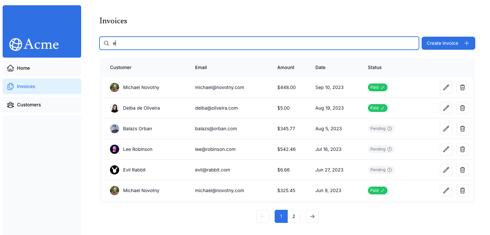

# 11. 検索とページネーションの追加

- https://nextjs.org/learn/dashboard-app/adding-search-and-pagination

この章では `useSearchParams` `usePathname` `useRouter` の使いを学びます。

請求書一覧ページの雛形を作成します。

`/dashboard/invoices/page.tsx`
```tsx
import Search from '@/app/ui/search';  // 特定の請求書を検索するためのコンポーネント
import Pagination from '@/app/ui/invoices/pagination';  // 請求書のページネーション用コンポーネント
import Table from '@/app/ui/invoices/table';  // 請求書テーブルの表示用コンポーネント
import { CreateInvoice } from '@/app/ui/invoices/buttons';
import { lusitana } from '@/app/ui/fonts';
import { InvoicesTableSkeleton } from '@/app/ui/skeletons';
import { Suspense } from 'react';


export default async function Page() {
  await new Promise((resolve) => setTimeout(resolve, 3000));
  return (
    <div className="w-full">
      <div className="flex w-full items-center justify-between">
        <h1 className={`${lusitana.className} text-2xl`}>Invoices</h1>
      </div>
      <div className="mt-4 flex items-center justify-between gap-2 md:mt-8">
        <Search placeholder="Search invoices..." />
        <CreateInvoice />
      </div>
      {/*  <Suspense key={query + currentPage} fallback={<InvoicesTableSkeleton />}>
        <Table query={query} currentPage={currentPage} />
      </Suspense> */}
      <div className="mt-5 flex w-full justify-center">
        {/* <Pagination totalPages={totalPages} /> */}
      </div>
    </div>
  )
}
```

## 検索にGETパラメータを使う理由

- ブックマーク可能
- 初回アクセス時にサーバーサイドレンダリングが容易
- GAなどでユーザーの行動を追跡しやすくなる


## 検索機能の追加

以下は検索機能を実装するために利用する Next.js クライアントフックです。

### 1. ユーザーの入力をキャプチャする


`handleSearch()` 関数を作成し、検索フォームの `onChange` にイベントリスナーとして追加します。

`/app/ui/search.tsx`
```tsx
'use client';  // クライアントコンポーネントなのでイベントリスナーとクライアントフックを使用できます。

export default function Search({ placeholder }: { placeholder: string }) {
  function handleChange(term: string) { // handleChangeの追加
    console.log(term);
  }

  return (
    <div className="relative flex flex-1 flex-shrink-0">
      <label htmlFor="search" className="sr-only">
        Search
      </label>
      <input
        className="peer block w-full rounded-md border border-gray-200 py-[9px] pl-10 text-sm outline-2 placeholder:text-gray-500"
        placeholder={placeholder}
        onChange={(e) => {  // onChangeイベントのリスナーにhandleChangeを設定
          handleChange(e.currentTarget.value)
        }}
      />
      <MagnifyingGlassIcon className="absolute left-3 top-1/2 h-[18px] w-[18px] -translate-y-1/2 text-gray-500 peer-focus:text-gray-900" />
    </div>
  );
}
```


### 2. 検索パラメータでURLを更新する

検索ボックスに入力された値でURLを書き換えます。 (ページをリロードせずにURLを更新します)

- [`useSearchParams`](https://nextjs.org/docs/app/api-reference/functions/use-search-params)  
現在のURLのGETパラメータを取得します。例えば `/dashboard/invoices?page=1&query=pending` であれば `{page: '1', query: 'pending'}` となります。
  - 戻り値は [URLSearchParams](https://developer.mozilla.org/en-US/docs/Web/API/URLSearchParams) になります
- [`usePathname`](https://nextjs.org/docs/app/api-reference/functions/use-params)  
現在のURLのパス名を取得します。例えば、ルートが `/dashboard/invoices` なら `'/dashboard/invoices'` となります。
- [`useRouter`](https://nextjs.org/docs/app/api-reference/functions/use-router)  
クライアントコンポーネント内でルート間のナビゲーションをプログラムで実現します。複数の方法が利用可能です。


`/app/ui/search.tsx`
```tsx
'use client';

import { MagnifyingGlassIcon } from '@heroicons/react/24/outline';
import { useSearchParams, usePathname, useRouter } from 'next/navigation';

export default function Search({ placeholder }: { placeholder: string }) {
  const searchParams: URLSearchParams = useSearchParams(); // アクセス時のURL
  const pathname = usePathname(); // アクセス時のパス
  const { replace } = useRouter();

  // 検索ボックスに入力された値でURLを更新するイベントハンドラ
  function handleChange(term: string) {
    const params = new URLSearchParams(searchParams);
    // console.log('params:', [...params.entries()]);
    if (term) {
      params.set('query', term)
    } else {
      params.delete('query')
    }
    // useRouterのルーターフックを利用することでページをリロードせずにURLを更新できます。
    replace(`${pathname}?${params.toString()}`);
  }

  return (
    <div className="relative flex flex-1 flex-shrink-0">
      <label htmlFor="search" className="sr-only">
        Search
      </label>
      <input
        className="peer block w-full rounded-md border border-gray-200 py-[9px] pl-10 text-sm outline-2 placeholder:text-gray-500"
        placeholder={placeholder}
        onChange={(e) => {handleChange(e.currentTarget.value)}}
      />
      <MagnifyingGlassIcon className="absolute left-3 top-1/2 h-[18px] w-[18px] -translate-y-1/2 text-gray-500 peer-focus:text-gray-900" />
    </div>
  );
}

```


### 3. URLと入力内容を同期させる

`?query=hogehoge` というGETパラメータ付きのURLにアクセスしたときに検索ボックスにパラメータが入力されるようにします。


`/app/ui/search.tsx`
```tsx
<input
  className="peer block w-full rounded-md border border-gray-200 py-[9px] pl-10 text-sm outline-2 placeholder:text-gray-500"
  placeholder={placeholder}
  onChange={(e) => {
    handleSearch(e.target.value);
  }}
  defaultValue={searchParams.get('query')?.toString()}
/>
```


### 4. テーブルの更新

検索クエリを反映するようにテーブルコンポーネントを更新します。

`/app/dashboard/invoices/page.tsx`
```tsx
// ...

export default async function Page(props: {searchParams?: Promise<{query?: string; page?: string;}>; }) {
  // URLから検索クエリ(query)と現在ページ(page)を取得
  const searchParams = await props.searchParams;
  const query = searchParams?.query || '';
  const currentPage = Number(searchParams?.page) || 1;
 
  return (
    <div className="w-full">
      {/* ... */}
      <Suspense key={query + currentPage} fallback={<InvoicesTableSkeleton />}>
        <Table query={query} currentPage={currentPage} />
      </Suspense>
      {/* ... */}
    </div>
  );
}
```

#### 補足1: Page関数の引数について

`page.tsx` の `Page()` 関数は `params` と `searchParams` という要素を持つオブジェクトを引数に取ります。  
[page.js - File Conventions - API Reference | NEXT.js](https://nextjs.org/docs/app/api-reference/file-conventions/page)


```tsx
export default function Page({
  params,
  searchParams,
}: {
  params: Promise<{ slug: string }>
  searchParams: Promise<{ [key: string]: string | string[] | undefined }>
}) {
  return <h1>My Page</h1>
}
```

#### 補足2: 繰り返しの描画

繰り返しの描画は `map` を利用する

```tsx
<div>
  {invoices?.map((invoice) => (
    <div key={invoice.id}>
      <div>{invoice.email}</div>
    </div>
  )}
</div>
```

`/app/ui/invoices/table.tsx`
```tsx
// ...
import { fetchFilteredInvoices } from '@/app/lib/data';

export default async function InvoicesTable({query, currentPage}: {query: string; currentPage: number;}) {
  const invoices = await fetchFilteredInvoices(query, currentPage);

  return (
    <div className="mt-6 flow-root">
      <div className="inline-block min-w-full align-middle">
        <div className="rounded-lg bg-gray-50 p-2 md:pt-0">
          {/* ... */}
          <table className="hidden min-w-full text-gray-900 md:table">
            <thead className="rounded-lg text-left text-sm font-normal">
              <tr>
                {/* ... */}
              </tr>
            </thead>
            <tbody className="bg-white">
              {invoices?.map((invoice) => (
                <tr key={invoice.id} className="..." >
                  <td className="whitespace-nowrap py-3 pl-6 pr-3">
                    <div className="flex items-center gap-3">
                      <Image
                        src={invoice.image_url}
                        className="rounded-full"
                        width={28}
                        height={28}
                        alt={`${invoice.name}'s profile picture`}
                      />
                      <p>{invoice.name}</p>
                    </div>
                  </td>
                  <td className="whitespace-nowrap px-3 py-3">
                    {invoice.email}
                  </td>
                  <td className="whitespace-nowrap px-3 py-3">
                    {formatCurrency(invoice.amount)}
                  </td>
                  <td className="whitespace-nowrap px-3 py-3">
                    {formatDateToLocal(invoice.date)}
                  </td>
                  <td className="whitespace-nowrap px-3 py-3">
                    <InvoiceStatus status={invoice.status} />
                  </td>
                  <td className="whitespace-nowrap py-3 pl-6 pr-3">
                    <div className="flex justify-end gap-3">
                      <UpdateInvoice id={invoice.id} />
                      <DeleteInvoice id={invoice.id} />
                    </div>
                  </td>
                </tr>
              ))}
            </tbody>
          </table>
        </div>
      </div>
    </div>
  );
}
```

### 5. デバウンス

現在の実装だと、入力の都度イベントハンドラが発火してしまうため、`use-debounce` を利用してユーザーが入力を一定時間移譲止めたときにのみ発火するようにします。


```bash
pnpm i use-debounce
```

`useDebouncedCallback` をインポートし、 `handleSearch` の内容をラップします。  
今回は300ミリ秒経過後にコードを実行します。

`/app/ui/search.tsx`
```tsx
// ...
import { useDebouncedCallback } from 'use-debounce';  // インポート
 
// イベントハンドラの処理をuseDebouncedCallbackでラップ
const handleSearch = useDebouncedCallback((term) => {
  console.log(`Searching... ${term}`);
 
  const params = new URLSearchParams(searchParams);
  if (term) {
    params.set('query', term);
  } else {
    params.delete('query');
  }
  replace(`${pathname}?${params.toString()}`);
}, 300);
```


## ページネーションの追加


`/app/dashboard/invoices/page.tsx`
```tsx
// ...
import { fetchInvoicesPages } from '@/app/lib/data';


export default async function Page(props: { searchParams: { query?: string, page?: string } }) {
  // ...
  const totalPages: number = await fetchInvoicesPages(query); // 検索結果に基づく総ページ数を取得

  await new Promise((resolve) => setTimeout(resolve, 3000));
  return (
    <div className="w-full">
      {/* ... */}

      {/* Paginationコンポーネントの読み込み */}
      <div className="mt-5 flex w-full justify-center">
        <Pagination totalPages={totalPages} />
      </div>
    </div>
  )
}
```

ページネーションを描画するコンポーネントを実装します。  

`/app/ui/invoices/pagination.tsx`
```tsx
'use client';

// ...
import { generatePagination } from '@/app/lib/utils';
import { usePathname, useSearchParams } from 'next/navigation'; // 追加

export default function Pagination({ totalPages }: { totalPages: number }) {
  // 現在のURL情報
  const pathname = usePathname();
  const searchParams = useSearchParams();
  const currentPage = Number(searchParams.get('page')) || 1;

  // 指定されたページのURLを生成する関数
  const createPageURL = (pageNumber: number | string) => {
    const params = new URLSearchParams(searchParams);
    params.set('page', pageNumber.toString());
    return `${pathname}?${params.toString()}`;
  }

  // 表示するページネーションボタンを表す配列
  // [1, "...", 5, 6, 7, "...", 10] みたいな
  const allPages = generatePagination(currentPage, totalPages);

  return (
    {/* ページネーションの描画 */}
    <>
      <div className="inline-flex">
        <PaginationArrow
          direction="left"
          href={createPageURL(currentPage - 1)}
          isDisabled={currentPage <= 1}
        />

        <div className="flex -space-x-px">
          {allPages.map((page, index) => {
            let position: 'first' | 'last' | 'single' | 'middle' | undefined;

            if (index === 0) position = 'first';
            if (index === allPages.length - 1) position = 'last';
            if (allPages.length === 1) position = 'single';
            if (page === '...') position = 'middle';

            return (
              <PaginationNumber
                key={`${page}-${index}`}
                href={createPageURL(page)}
                page={page}
                position={position}
                isActive={currentPage === page}
              />
            );
          })}
        </div>

        <PaginationArrow
          direction="right"
          href={createPageURL(currentPage + 1)}
          isDisabled={currentPage >= totalPages}
        />
      </div>
    </>
  );
}

// ...

```

検索クエリが更新されたときに、、ページを `1` にリセットします。

`/app/ui/search.tsx`
```tsx
// ...

export default function Search({ placeholder }: { placeholder: string }) {
  // ...

  const handleSearch = useDebouncedCallback((term: string) => {
    console.log(`Searching... ${term}`);
    const params = new URLSearchParams(searchParams);
    params.set('page', '1');      // 追加: 検索時にページ番号をリセット
    if (term) {
      params.set('query', term)
    } else {
      params.delete('query')
    }
    replace(`${pathname}?${params.toString()}`);
  }, 300);

  return (
    {/* ... */}
  );
}

```


