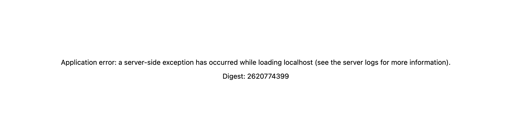
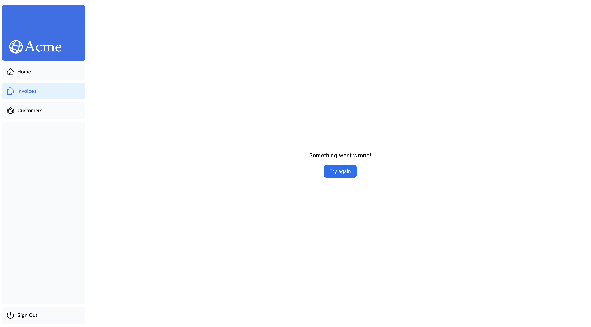

# 13. エラー処理

- https://nextjs.org/learn/dashboard-app/error-handling

## try/catchサーバーアクションへの追加

まずはアクション内でキャッチされていない例外が発生した場合にどうなるかを見てみましょう。

`/app/lib/actions.ts`
```ts
export async function deleteInvoice(id: string) {
  throw new Error('Failed to Delete Invoice');  // わざと例外を発生させる

  await sql`DELETE FROM invoices WHERE id = ${id}`;
  revalidatePath('/dashboard/invoices');
}
```

請求書を削除しようとすると、ローカルホストで以下のようなエラーが表示されページ自体が全く表示されなくなります。

```
 ⨯ Error: Failed to Delete Invoice
    at deleteInvoice (app/lib/actions.ts:81:9)
  79 |
  80 | export async function deleteInvoice(id: string) {
> 81 |   throw new Error('Failed to Delete Invoice');  // わざと例外を発生させる
     |         ^
  82 |
  83 |   await sql`DELETE FROM invoices WHERE id = ${id}`;
  84 |   revalidatePath('/dashboard/invoices');  // キャッシュをクリアして、請求書一覧ページを再検証・データを再取得 {
  digest: '770613014'
}
 POST /dashboard/invoices 500 in 173ms
```




エラーを適切に処理できるように、 `try/catch` をサーバーアクションに追加してメッセージエラーメッセージを返したくなるところですが、 `<form action={...}>` に設定される関数の戻り値の型は `Promise<void>` が期待されているため、ビルドで失敗します。  
※ ちなみに、、、 `try/catch` を利用する場合は `redirect` を `try` 節に入れないように注意してください。`redirect` はエラーをスローすることで動作するため、エラーがキャッチされると動作しなくなります。


`/app/lib/actions.ts`
```ts
export async function createInvoice(formData: FormData) {
  // ...

  try {
    await sql`
      INSERT INTO invoices (customer_id, amount, status, date)
      VALUES (${customerId}, ${amountInCents}, ${status}, ${data})
    `;
  } catch (error) {
    console.error(error);
    return {
      message: 'Database Error: Failed to Create Invoice.',
    }
  }

  revalidatePath('/dashboard/invoices');  // キャッシュをクリアして、請求書一覧ページを再検証・データを再取得
  redirect('/dashboard/invoices');  // 請求書一覧ページにリダイレクト
}
```


## `error.tsx` ですべてのエラーを処理する

- [error.js | NEXT.js](https://nextjs.org/docs/app/api-reference/file-conventions/error)

error.tsxファイルは、ルートセグメントのUI境界を定義するために使用できます。予期しないエラーの受け皿として機能し、ユーザーにフォールバックUIを表示することを可能にします。

エラーハンドリング関数( `Error` )は2つのプロパティを受け入れます。

- `error` : JavaScriptのネイティブインスタンス [`Error`](https://developer.mozilla.org/ja/docs/Web/JavaScript/Reference/Global_Objects/Error) です。
- `reset` : エラー境界をリセットする関数です。実行されると、ルートセグメントの再レンダリングを試みます。

`/app/dashboard/invoices/error.tsx`
```tsx
'use client';  // error.tsx はクライアントコンポーネントである必要があります。

import { useEffect } from "react";

export default function Error({ error, reset }: {
  error: Error & { digest?: string };
  reset: () => void;
}) {
  useEffect(() => {
    // オプションでエラーをエラー報告サービスに記録する
    console.error(error);
  }, [error]);

  return (
    <main className="flex h-full flex-col items-center justify-center">
      <h2 className="text-center">Something went wrong!</h2>
      <button
        className="mt-4 rounded-md bg-blue-500 px-4 py-2 text-sm text-white transition-colors hover:bg-blue-400"
        onClick={
          // 請求書ルートを再レンダリングして回復を試みる
          () => reset()
        }
      >
        Try again
      </button>
    </main>
  )
}
```




### `Error & { digest?: string }` 型について


`Error & { digest?: string }` は TypeScript の交差型（intersection type）です。  
Error 型が持つプロパティ（name, message, stack など）に加えて、digest という省略可能(`?`がついている)な文字列プロパティを持つオブジェクトであることを表します。  
Next.js のエラーバウンダリでは内部的にエラーに digest（内部で使う識別用ハッシュ）を付与することがあるため、その情報が渡ってくる可能性を考慮してこの型になっています。


### 請求書の作成・編集画面のSQLのエラーハンドリング

捕捉されていない例外を表示できる画面ができたので、請求書の作成・編集処理のSQLを `try/catch` で囲んでエラーハンドリングを行います。


`/app/lib/actions.ts`
```ts
export async function createInvoice(formData: FormData) {
  // ...
  try {
    await sql`
      INSERT INTO invoices (customer_id, amount, status, date)
      VALUES (${customerId}, ${amountInCents}, ${status}, ${data})
    `;
  } catch (error) {
    console.error(error);
    throw new Error('Database Error: Failed to Create Invoice.');
  }

  revalidatePath('/dashboard/invoices');  // キャッシュをクリアして、請求書一覧ページを再検証・データを再取得
  redirect('/dashboard/invoices');  // 請求書一覧ページにリダイレクト
}


export async function updateInvoice(id: string, formData: FormData) {
  // ...
  try {
    await sql`
      UPDATE invoices
      SET customer_id = ${customerId}, amount = ${amountInCents}, status = ${status}
      WHERE id = ${id}
    `;
  } catch (error) {
    console.error(error);
    throw new Error('Database Error: Failed to Update Invoice.');
  }

  revalidatePath('/dashboard/invoices');  // キャッシュをクリアして、請求書一覧ページを再検証・データを再取得
  redirect('/dashboard/invoices');  // 請求書一覧ページにリダイレクト
}
```

## `notFound` 関数で404エラーを処理する

- [not-found.js | NEXT.js](https://nextjs.org/docs/app/api-reference/file-conventions/not-found)
- [notFound - API Reference | NEXT.js](https://nextjs.org/docs/app/api-reference/functions/not-found)


エラーを適切に処理するもう一つの方法は、 `notFound` 関数を使用することです。  
 `error.tsx` はキャッチされていない例外をキャッチするのに便利ですが、`notFound` は存在しないリソースを取得しようとする場合にも使用できます。

指定された `id` で請求書を取得できなかった場合に `notFound` 関数を呼び出す呼び出す条件を追加します。

`/app/dashboard/invoices/[id]/edit/page.tsx`
```tsx
// ...
import { notFound } from "next/navigation";  // 追加

export default async function Page(props: {params: Promise<{id: string}>}) {
  const params = await props.params;
  const id = params.id;
  // フォームの初期値として請求書データと顧客データを取得
  const [invoice, customers] = await Promise.all([
    fetchInvoiceById(id),
    fetchCustomers()
  ])

  if (!invoice) {
    notFound();  // 存在しない請求書IDが指定された場合は404エラーページを表示
  }
  // ...
}

```


次に、ユーザーにエラー UI を表示するために、`/app/dashboard/invoices/[id]/edit` 内に `not-found.tsx` ファイルを作成します。

`/app/dashboard/invoices/[id]/edit/not-found.tsx`
```tsx
import Link from 'next/link';
import { FaceFrownIcon } from '@heroicons/react/24/outline';
 
export default function NotFound() {
  return (
    <main className="flex h-full flex-col items-center justify-center gap-2">
      <FaceFrownIcon className="w-10 text-gray-400" />
      <h2 className="text-xl font-semibold">404 Not Found</h2>
      <p>Could not find the requested invoice.</p>
      <Link
        href="/dashboard/invoices"
        className="mt-4 rounded-md bg-blue-500 px-4 py-2 text-sm text-white transition-colors hover:bg-blue-400"
      >
        Go Back
      </Link>
    </main>
  );
}
```

存在しないURLにアクセスしてみます

http://localhost:3000/dashboard/invoices/aaaaaaaa-aaaa-aaaa-aaaa-aaaaaaaaaaaa/edit


ちなみに、**notFoundはerror.tsxよりも優先される**ため、より具体的なエラーを処理したい場合に利用できます！
