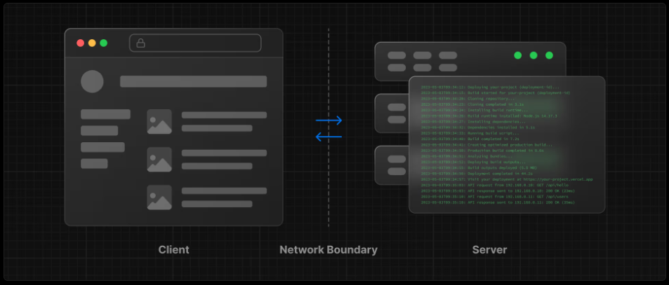
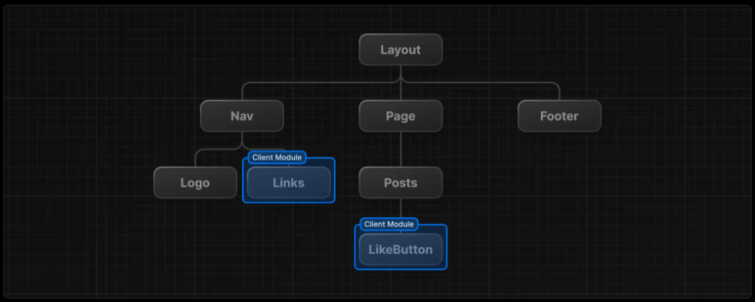

サーバーおよびクライアントコンポーネント
---

- https://nextjs.org/learn/react-foundations/server-and-client-components
- [ソースコード](../../react_tutorial/10_server_and_client_components/)


# サーバーとクライアント



それぞれの環境には、独自の機能と制約があります。例えば、サーバーサイドでレンダリングを行うと、クライアントからのAPIリクエストを削減できるため、パフォーマンスを向上させることができます。しかし、UIをインタラクティブにするには、クライアント側でDOMを更新する必要があります。

そのため、サーバーとクライアント向けに記述するコードは必ずしも同じではありません。特定の操作（データの取得やユーザー状態の管理など）は、どちらか一方の環境の方が適している場合があります。


# ネットワーク境界

ネットワーク境界とは、異なる環境を分離する概念的な境界線です。

Reactでは、コンポーネントツリー内のネットワーク境界を配置する場所を選択します。  
例えば、サーバー側でデータを取得しユーザーの投稿をレンダリング（サーバーコンポーネント）し、クライアント側で各投稿のインタラクティブなLikeButtonをレンダリング（クライアントコンポーネント）といった具合です。

同様に、サーバーでレンダリングされページ間で共有されるNavコンポーネントを作成できますが、リンクのアクティブ状態を表示したい場合は、リンクのリストをクライアント側でレンダリングできます。



裏側では、コンポーネントは2つのモジュールグラフに分割されます。

- **サーバーモジュールグラフ（ツリー）**  
サーバー上でレンダリングされるすべてのサーバーコンポーネントが含まれます。
- **クライアントモジュールグラフ（ツリー）**  
すべてのクライアントコンポーネントが含まれます。

サーバーコンポーネントがレンダリングされた後、**React Server Component Payload（RSC）** と呼ばれる特殊なデータ形式がクライアントに送信されます。RSCペイロードには以下が含まれます：

- サーバーコンポーネントのレンダリング結果
- クライアントコンポーネントがレンダリングされるべき位置のプレースホルダーと、それらのJavaScriptファイルへの参照

Reactはこの情報を使用してサーバーコンポーネントとクライアントコンポーネントを統合し、クライアント側のDOMを更新します。


# クライアントコンポーネントの使用

Next.jsはデフォルトでサーバーコンポーネントを使用します。クライアントコンポーネントを利用するには明示的な宣言が必要です。

先程のエラーを確認すると、Next.jsはサーバーコンポーネント内で `useState` にアクセスしようとしていることを警告しています。

新たに `LikeButton` コンポーネントをエクスポートするファイル `app/components/like-button.js` を作成します。


`app/components/like-button.js`
```js
'use client';  // クライアント側でコンポーネントをレンダリングすることを明示

import { useState } from 'react';

export default function LikeButton() {
  const [likes, setLikes] = useState(0)
  function handleClick() {
    setLikes(like + 1);
  }

  return <button onClick={handleClick}>like ({like})</button>;

}
```

`app/page.js`
```js
// LikeButtonはデフォルトエクスポートされているので {} は不要
import LikeButton from './components/like-button';

function Header({ title }) {
  return <h1>{title ? title : "Default title"}</h1>;
}

export default function HomePage() {
  const names = ["Alice", "Bob", "Charlie"];

  return (
    <div>
      <Header title="Develop. Preview. Ship." />
      <ul>
        {
          names.map((name, i) => (
            <li key={i}>{name}</li>
          ))
        }
      </ul>
      <LikeButton />
    </div>
  )
}
```


**※デフォルトエクスポートと名前付きエクスポート**

* `import LikeButton from './components/like-button';`
    * **デフォルトエクスポート** されたものをインポートするための書き方です。
* `import { LikeButton } from './components/like-button';`
    * **名前付きエクスポート** されたものを `{}` で指定してインポートするための書き方です。
